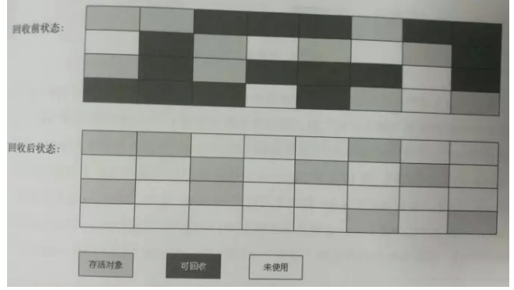
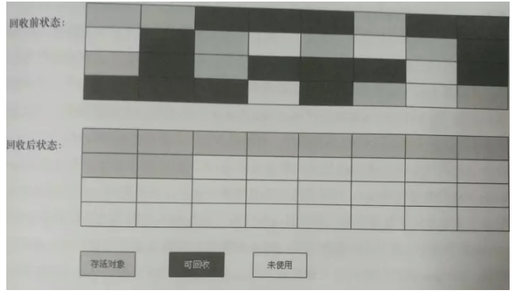
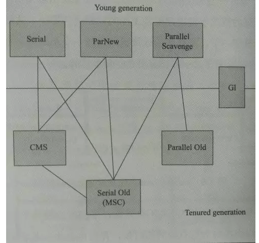

<!-- TOC -->

- [jvm](#jvm)
    - [一篇文章彻底搞定所有GC面试问题](#一篇文章彻底搞定所有gc面试问题)
        - [gc作用](#gc作用)
        - [什么时候](#什么时候)
        - [对谁](#对谁)
        - [做了什么](#做了什么)
    - [jvm 优化](#jvm-优化)
        - [逃逸分析](#逃逸分析)

<!-- /TOC -->

# jvm
## 一篇文章彻底搞定所有GC面试问题
```
众所周知，在C++，内存的管理是程序员的任务，包括对象的创建和回收（内存的申请和释放），而在java中，我们可以通过以下四种方式创建对象（面试考点）：

new关键字创建对象
clone方法克隆产生对象
反序列化获得对象
通过反射创建对象

而在java中对象的回收主要是GC完成：GC会在合适的时间被触发，完成垃圾回收，将不需要的内存空间回收释放，避免无限制的内存增长导致的OOM。由此可以看出，GC在java相关的应用程序中重要性，这也是为什么面试官热衷GC相关的面试问题。大部分面试，GC相关问题都是这样开始的：“你知道GC吗”？、“你了解GC机制吗”？

上面的类似提问该从何处着手呢？往下看之前，建议读者先思考：你是如何组织这个问题的回答的？这类似很“宽泛”的问题，其实并不容易回答好，会给人一种：我明明知道相关知识点，但是却又好像无话可说。比如说GC，它就是用来垃圾回收的啊，但是这样一句话不能让面试官充分了解你，你也成功的把话“聊死”了，反正不会是面试的加分项......这类宽泛的问题不仅仅考察你对知识点的掌握，其实也考察读者的文字组织、交流沟通能力~

如果博主遇到类似“宽泛”的问题，我会先预设：提出这个问题的面试官对问题的相关知识点“一无所知”。在这个前提下，我会依次从以下五个方面组织该问题的回答（这也是本文后续的主要内容）：

GC作用
GC在什么时候
对谁
做了什么事情
GC的种类及各自的特点
```

### gc作用

这个比较简单：在适当时候帮助回收JVM中的“垃圾”，接下来你可以接着说：这句话可以分为以下三个方面回答：什么时候、对谁(怎么定义“垃圾”)，做了什么(如何回收)——这也就成功将话题向下面三点展开了：

### 什么时候

也就是GC会在什么时候触发，主要有以下几种触发条件：
* 执行System.gc()的时候：建议执行Full GC，但是JVM并不保证一定会执行
* 新生代空间不足（下面会详细展开）
* 老年代空间不足（下面会详细展开）

什么意思呢？对象大都在Eden区分配内存，如果某个时刻JVM需要给某一个对象在Eden区上分配一块内存，但是此时Eden区剩余的连续内存小于该对象需要的内存，Eden区空间不足会触发minor GC。触发minor GC前会检查之前每次Minor GC时晋升到老年代的平均对象大小是否大于老年代剩余空间大小，如果大于，则直接触发Full GC；否则，查看HandlePromotionFailure参数的值，如果为false，则直接触发Full GC；如果为true（默认为true，表示允许担保失败，虽然剩余空间大于之前晋升到老年代的平均大小，但是依旧可能担保失败），则仅触发Minor GC，如果期间发生老年代不足以容纳新生代存活的对象，此时会触发Full GC 。

老年代满了，会触发Full GC（回收整个堆内存）。关于老年代：
1. 分配很大的对象：大对象直接进入老年代，经常出现大对象容易导致内存还有不少空间时就提前触发垃圾收集以获取足够多的连续空间；
2. 长期存活的对象将进入老年代；
3. 如果survivor空间中相同年龄所有对象大小的总和大于survivor空间的一半，年龄大于等于该年龄的对象就可以直接进入老年代；
4. CMS GC在出现promotion failure和concurrent mode failure的时候

上面这三种情况会导致“老年代“满”，会触发full GC。
### 对谁

  对不再使用的对象，怎么判别一个对象是否还活着呢？这时可以从“引用计数法”讲到“可达性分析算法”。
- 引用计数法：给对象添加一个引用计数器，每当有地方引用它时，计数器加1；当引用失效时，计数器减1。引用计数法实现简单，判定效率高，但是它很难解决对象之间的互相循环引用（引用环问题）的问题。主流的java虚拟机没有选用引用计数法来管理内存。
- 可达性分析算法（主流实现判断对象是否“活着”算法）：算法的基本思路就是以一系列的称为“GC Roots”的对象作为起点，从这些节点开始向下搜索，搜索所走过的路径称为引用链，当一个对象到GC Roots没有任何引用链相连的时候（即该对象不可达），则证明此对象是不可用的。在java中，可作为GC Roots的对象包括以下几种：栈中引用的对象（栈帧中的本地变量表）、方法区中类静态属性引用的对象、方法区中常量引用的对象。

在“可达性分析算法”中标记为不可达的对象，并非是“非死不可”的，还有回旋的余地。要宣告一个对象死亡，至少要经过两次标记的过程：如果对象在进行可达性分析后发现没有与GC Roots相连的引用链，那它将会被第一次标记并进行筛选，筛选的条件是此对象是否有必要执行finalize方法。如果对象没有覆盖finalize方法或者该方法已经执行过了，则被视为“没有必要执行”，宣告死亡。剩下的对象将被加入一个低优先级的队列中执行finalize方法。这里的执行指的是会触发这个方法，并不保证执行完该方法（只保证虚拟机会触发该方法），否则如该方法存在死循环，该队列就已经卡死了，GC也瘫痪了，所以只保证触发该方法。Finalize是对象逃脱死亡的最后一次机会（可以在finalize方法中重新与引用链上的任何一个对象建立关联）。在触发finalize方法之后，GC将对该队列中的对象进行第二次标记，如果此时该对象仍不在引用链上，该对象就会被回收。如果第二次标记前，该对象成功与引用链上的对象建立了连接，它会被移出“即将回收的集合”，自救成功。注：任何一个对象的finalize方法只会被系统调用一次，即在finalize方法中最多能实现一次自救。另外，finalize方法在jdk9中被标记为“废弃”方法了，不建议使用。
### 做了什么

不可达的对象，如何被回收：

1. 标记-清除法：在标记（可达性算法标记）完成后统一回收所有被标记的对象。它是最基础的算法，后续算法都是基于它的不足而改进，主要不足有：效率问题，标记和清除效率都不高；另外一个是空间问题，标记清除后会产生大量不连续的内存碎片，碎片太多可能导致在需要分配较大对象时，无法找到足够的连续内存而不得不提前触发另一次垃圾回收动作。标记清除算法回收后的内存图，如下所示：


2. 复制算法：为了解决标记清除算法的效率问题，“复制算法”出现了。“复制算法”将可用内存分为大小相同的两部分，每次只使用其中的一块，当使用的那一块内存快用尽时，就将还存活的对象复制到另外一块内存上，然后把已经使用过的内存空间一次性清理掉。这样就是每次都对整个搬去内存进行回收，也不用考虑内存碎片等复杂问题，只需要移动指针，按顺序分配内存即可，实现简单，运行高效。但是代价就是每次只能使用一半的内存，代价有点高。现代商业虚拟机都是采用这种手机算法来回收新生代的。实际上新生代中的对象98%都是“朝生夕死”所以远远用不着每次仅仅使用一般的内存。新生代中将内存划分为一块较大的Eden空间和两块较小的Survivor空间，每次使用Eden和其中一块Survivor。当回收时，将Eden和使用的Survivor中还存活的对象一次性复制到另外一块Survivor空间上，最后清理掉Eden和刚刚使用过的Survivor空间。Hotspot默认Eden/Survivor=8，即每次可以使用新生代中90%的容量（80%Eden + 10%Survivor），只有10%会被“浪费”。当然我们没法保证每次回收都只有不多于10%的对象存活，当Survivor空间不够用时（超过10%的对象存活），需要依赖其他内存进行分配担保（这里指老年代），放不下的存活对象将进入老年代。


3. 标记-整理法：复制收集算法在对象存活率较高时就要进行较多的复制操作，效率将会变低。更关键是，如果不想有空间的浪费，就需要有额外的空间进行分配担保，以应对被使用的内存中所有对象都100%存活的极端情况，所以老年代一般不采用“复制算法”（没有担保人）。根据老年代的特点，提出了“标记-整理法”：标记过程不变，仍使用“可达性分析算法”，标记完后不是直接对可回收对象进行清理，而是让所有存活的对象都向一端移动，然后直接清理掉端边界以外的内存。如下图所示：



4. 分代收集算法：JVM在实际垃圾回收中实际使用的是分代收集算法：根据对象存活周期的不同将内存划分为：新生代和老年代。在新生代每次都只有少量对象存活，选用复制算法；老年代中因为对象存活率高、没有额外空间对它进行分配担保，就必须使用标记-整理法或是标记-清理法进行回收。

上面的不同算法在JVM中有不同的垃圾回收器的实现，在JVM中主要有下面几种收集器：

新生代收集器有：Serial收集器、ParNew收集器、Parallel Scavenge收集器；老年代收集器：Cocurrent Mark Sweep(CMS)收集器、Serial Old（MSC）收集器、Parallel Old收集器。另外就是G1收集器，G1独自管理整个内存，不再分新生代和老年代了。上图中，如果两个收集器之间有连线，表示他们可以兼容使用；无连线则表示它们不能一起工作（不兼容）。

 - Serial收集器（新生代收集器）：复制算法、Serial：串行的意思。由名字就可知这是一个单线程的收集器，“单线程”的意义并不仅仅说明它只会使用一个cpu或是一条收集线程去完成垃圾收集工作，更重要的是在它进行垃圾收集时，必须暂停其他所有的工作线程，直到垃圾收集结束。“Stop the world”是由虚拟机在后台自动发起和完成的，在用户不可见的情况下把用户正常工作的线程全部停掉，意味着“你的计算机每工作一小时就会暂停响应5分钟。但是实际上它依然是虚拟机运行在client模式下的默认新生代收集器。它也有着优于其他收集器的地方：简单而高效。在用户的桌面应用场景中，分配各虚拟机管理的内存一般不会很大，收集几十兆甚至一两百兆的新生代，停顿时间可以控制在几十毫秒最多一百多毫秒以内，只要是不平凡发生这点停顿是可以接收的。所以Serial收集器对于运行在Client模式下的虚拟机来说是一个很好的选择。

- ParNew收集器（新生代收集器）:它其实就是Serial收集器的多线程版本，复制算法，除了使用多条线程进行垃圾收集外，其余行为包括Serial收集器可用的所有控制参数。收集算法、Stop The World、回收策略等都与Serial收集器完全一样。Serial和parNew两个收集器都可以并且只可以与老年代的CMS和serial old GC一起工作。

 - Parallel Scavenge收集器（新生代）：它是使用复制算法的收集器，它可以和parallel old和serial old一起工作。它的关注点与其他收集器不同，CMS等收集器是尽可能的缩短垃圾收集时用户线程的停顿时间。Parallel Scavenge收集器关注的是吞吐量，目标是达到一个可控制的吞吐量，吞吐量=运行用户代码时间 /（运行用户代码时间+垃圾收集时间），即为CPU运行用户代码的时间与CPU总消耗时间的网速。停顿时间越短就越适合需要与用户交互的程序，良好的响应速度能提升用户体验；而高吞吐量则可以高效率的利用CPU时间，尽快完成程序的运算任务，适合在后台运算运算并且不需要太多交互的任务。Parallel Scavenge收集器提供了设置最大垃圾收集停顿时间:-XX：MaxGCPauseMills(收集器将尽量保证内存回收时间不超过设定值，但是注意这是以牺牲吞吐量和新生代空间为代价的：把它设置得太小：系统将会调整新生代空间，因为回收300M新生代肯定比回收500M快，但是GC的频率也随之增大了)和吞吐量大小:-XX:GCTimeRatio的参数以及一个开关参数UseAdaptiveSizePolicy，可以自动优化调整新生代（-xnm）大小、Eden与Survivor比值（-XX:SurvivorRatio）、晋升老年代大小（-XX：PretenuredThreshold）等细节参数，虚拟机会根据当前系统运行情况当太调整这些参数已提供最合适的停顿时间或者最大的吞吐量，这种方式称为“GC自适应”的调节策略。如果对收集器运作原理不太了解，手动优化存在困难时，使用Parallel Scavenge收集器把内存优化管理的任务交给虚拟机（只需要设置基本内存数据：-Xmx、最大垃圾收停顿时间（更关注停顿时间）或者吞吐量（更关注吞吐量））。自适应调节策略”也是Parallel Scavenge收集器与ParNew收集器的一个重要区别。

 - Serial Old是Serial收集器的老年代版本，它同样是是一个单线程收集器。使用“标记-整理”算法，主要意义也是给Client模式下的虚拟机使用。

 - Parallel Old是Parallel Scavenge收集器的老年代版本，采用“标记-整理算法”。在注重吞吐量以及CPU资源敏感的场合可以优先考虑：Parallel Scavenge + Parallel Old组合。

- CMS（Concurrent Mark Sweep）收集器：一种以获取最短回收停顿时间为目标的收集器（希望系统停顿时间最短，以给用户带来较好的体验）。从名字中的“Mark Sweep”可以看出CMS收集器是基于“标记-清除”算法实现的，它的运作过程可分为4个步骤：初始标记、并发标记、重新标记、并发清除。其中，初始标记、重新标记这两个步骤仍然需要“Stop the World”。初始标记仅仅只是标记一下GC Roots能直接关联到的对象，速度很快；并发标记阶段就是进行GC Roots Tracing的过程；而重新标记阶段，则是为了修正并发标记期间因用户程序继续运行而导致标记产生变动的那一部分对象的标记记录，这一阶段的停顿时间一般会比初始标记阶段稍长一些，但远比并发标记时间短。整个过程只有初试标记和重新标记需要“stop the world”，具有并发、低停顿优点。但是它由三个明显缺点：1.CMS收集器对CPU资源非常敏感：在并发阶段虽然不会导致用户线程停顿，但是会因为占用了一部分线程（CPU资源）而导致应用程序变慢，总吞吐量降低；CMS收集器无法收集浮动垃圾：可能出现“Concurrent Mode Failure”失败而导致来一次Full GC的产生（这时会使用serial odl作为CMS的临时替代收集器）。CMS并发清理阶段用户线程还在运行，期间自然会有新的垃圾产生，只能等待下一次GC时在清理，这部分垃圾称为“浮动垃圾”。另外，由于在垃圾收集阶段用户线程还需要运行，那也就是还需要预留足够的内存空间给用户线程使用，因此CMS收集器不能像其他收集器那样等到老年代几乎被完全填满了在进行收集，需要预留一部分空间供并发收集期间的程序运作使用；CMS是一款基于“标记-清除”算法实现的收集器，这意味着GC后会有大量的空间碎片产生。空间碎片过多将会给大对象分配带来很大的麻烦，往往会出现老年代还有很大的空间剩余，但是无法找到足够大的连续空间分配给当前对象，从而不得不提前触发一次Full GC。对此CMS提供了一个参数，用于在触发Full GC时开启内存碎片的合并整理过程，内存整理过程是无法并发的，空间碎片问题没有了，但是停顿时间不得不变长。

- G1收集器：是当今收集器技术发展的最前沿超过之一。G1是一款面向服务端应用的垃圾收集器，具有如下特点：并发与并行：可以充分利用多CPU、多核环境来缩短“Stop the world”的时间；分代收集：G1可以不需要其他收集器配合就可以独立管理整个GC堆，但它能够采取不同的方式去处理新创建的对象和已经存活了一段时间、熬过多次GC的旧的对象以获得更好的收集效果；空间整合：与CMS的“标记-清理”算法不同，G1从整体来看是基于“标记-整理算法”，从局部（两个region之间）看是基于“复制”算法实现的。但无论如何，这两种算法意味着G1运作期间不会产生内存碎片，这种特性有利于程序长时间运行；可预测的停顿：这是G1相对于CMS的另一大优势，降低停顿时间是G1和CMS共同的关注点，但G1除了追求低停顿外，还能建立可预测的停顿时间模型，能让使用者明确指定在一个长度为M毫秒的时间片段内，消耗在在垃圾手机上的时间不得超过N毫秒，这几乎是实时的java垃圾收集器的特征了。在G1之前的其他收集器进行收集的范围都是整个新生代或者老年代，使用G1收集器时，它将整个java堆划分为多个大小相等的独立区域，虽然还有新生代和老年代的区别，但是新生代和老年代不再是物理隔离了，它们都是一部分Region（不需要连续）的集合。G1优先回收价值最大的Region（有限时间内获取尽可能高的效率）。G1收集器的运作大致可划分为以下几个步骤：初始标记、并发标记、最终标记、筛选回收。初试标记阶段仅仅是只是标记下GC Roots能直接关联到的对象，这阶段需要停顿线程，但是耗时很短；并发标记：从GC Roots开始对堆中对象进行可达性分析，找出活的对象，这部分耗时较长，但是可以与用户程序并发执行。最终标记：为了修正在并发标记期间因用户程序继续运行而导致标记产生变动的那一部分标记记录，这阶段需要停顿线程，但是可以并行执行。


另外，注意：jdk9及更新的版本中默认的是G1收集器；jdk8默认收集器：新生代GC：Parallel Scanvage收集器；老年代使用：parallel old收集器。

## jvm 优化

### 逃逸分析

逃逸分为两种：
1. 方法逃逸：当一个对象在方法中被定义后，可能作为调用参数被外部方法说引用。
2. 线程逃逸：通过复制给类变量或者作为实例变量在其他线程中可以被访问到。

逃逸分析——使得删除锁的优化成为了可能。如果它能确认某个加锁的对象不会逃逸出局部作用域，就可以进行锁删除。这意味着这个对象同时只可能被一个线程访问，因此也就没有必要防止其它线程对它进行访问了。这样的话这个锁就是可以删除的。这个便叫做锁消除。

```
如果证明一个对象不会逃逸方法外或者线程外，则可针对此变量进行一下三种优化：

栈上分配stack allocation：如果对象不会逃逸到方法外，则对此对象在栈上分配内存，则对象所占用的空间可以随栈出栈而别销毁。

同步消除synchronization Elimination：如果一个对象不会逃逸出线程，则对此变量的同步措施可消除。
Scalar replacement：标量scalar是不可再分解的量，比如基本数据类型，聚合量Aggregate是可以在被分解的，比如java中的对象。标量替换是将一个聚合量拆散，根据程序对此聚合量的访问情况，将其使用到的成员变量恢复到原始变量来访问就是标量替换。==逃逸分析如果证明一个对象不会被外部访问，并且此对象可以被拆散，则程序执行时可能不会创建此对象==。

-XX:+DoEscapeAnalysis开启逃逸分析；
-XX:+EliminateLocks开启同步消除；
-XX:+EliminateAllocations开启标量替换；

自旋锁
线程等待的方式有两种，挂起和自旋。
挂起操作需要进行线程调度，而且线程初次启动可能其所需数据不再处理器本地缓存中，由此也会引发一些开销和缓存的缺失。
如果此线程想要获取的锁往往很快可以释放，就让其采取“本地自旋”操作。

锁消除：虚拟机的运行时编译器在运行时如果检测到一些要求同步的代码上不可能发生共享数据竞争，则会去掉这些锁。
锁粗化：将临近的代码块用同一个锁合并起来。HotSpot虚拟机还有一些额外的锁优化的技术，虽然从技术上讲它们并不属于逃逸分析子系统中的一部分，但也是通过分析作用域来提高内部锁的性能。当连续获取同一个对象的锁时，HotSpot虚拟机会去检查多个锁区域是否能合并成一个更大的锁区域。这种聚合被称作锁粗化，它能够减少加锁和解锁的消耗。
参数设置:-XX:+EliminateLocks
消除无意义的锁获取和释放，可以提高程序运行性能。

轻量级锁
轻量级锁提升性能的依据是“绝大多数同步的锁都是不存在竞争的”，对于竞争的情况轻量级锁比传统的重量级锁更慢。
-XX:+UseHeavyMonitors可以禁用轻量级锁和偏向锁。


偏向锁 biased lock
偏向锁更近一步，在无竞争的情况下直接把整个同步消除掉。如果程序大多数锁总是被多个线程访问则没必要开启。-XX:+UseBiasedLocking开启偏向锁。

5.1 获取偏向锁过程
锁对象第一次被线程获取时，使用CAS操作把获取这个锁的线程id记录在mark word中，并更改标志位01，成功则此线程持有偏向锁，持有偏向锁的线程每次进入锁对象相关的代码块时，虚拟机都不会进行任何同步操作；

另一个线程尝试获取这个锁时，偏向锁撤销。如果锁对象未被锁定则恢复到未被锁定状态，如果此对象正在被锁定则变成轻量级锁。

```