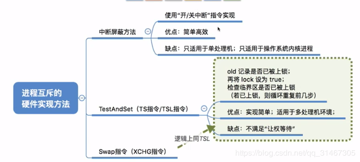
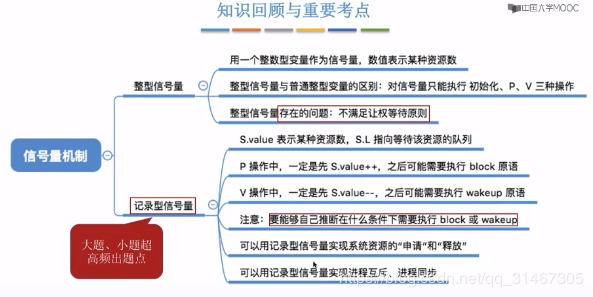
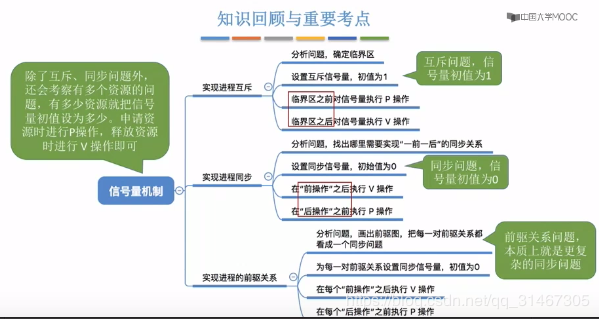
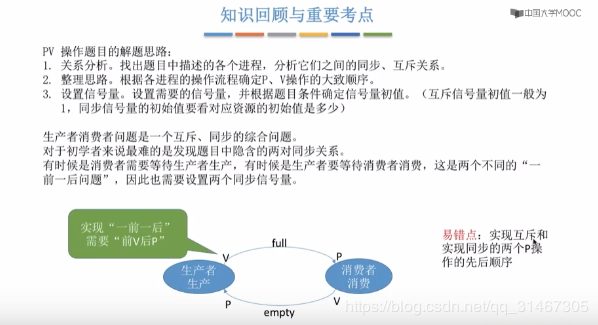
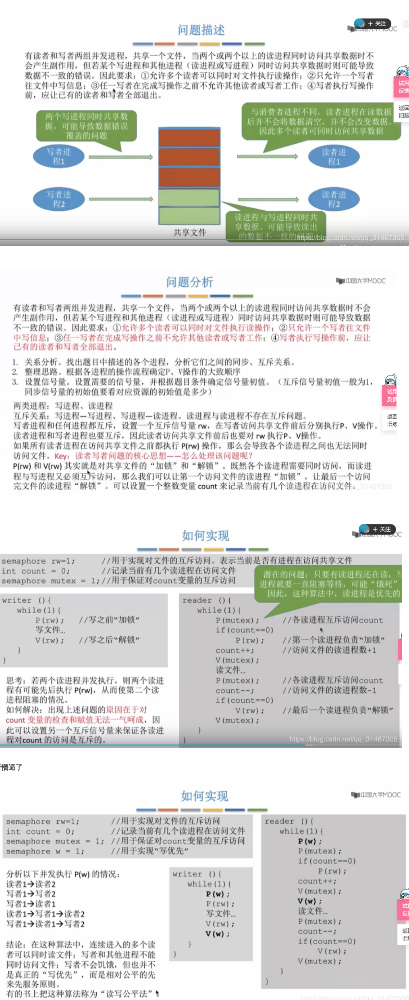
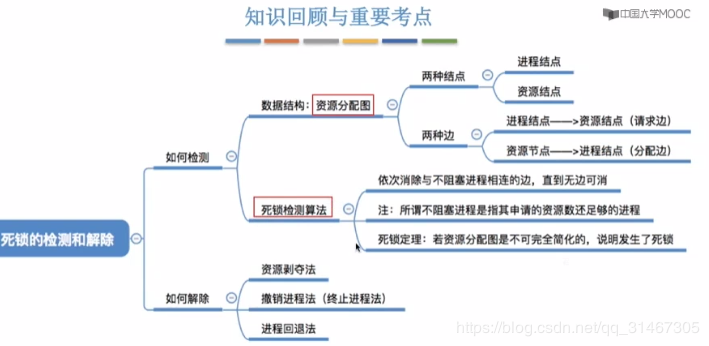

<!-- TOC -->

- [1.操作系统的基本概念](#1操作系统的基本概念)
- [2.进程和线程](#2进程和线程)
    - [2.1进程调度](#21进程调度)
    - [2.2进程同步 进程互斥](#22进程同步-进程互斥)
    - [2.3死锁](#23死锁)
- [面经](#面经)

<!-- /TOC -->
## 1.操作系统的基本概念

os指的是控制和管理整个计算机系统硬件和软件资源的系统软件。作为用户和计算机硬件之间的接口（命令接口，程序接口，gui）

四大特征：并发 共享 异步 虚拟，并发共享是相互存在的。

系统调用：是os提供给应用程序使用的接口，发出系统调用来等待os的服务。按功能分类包含设备管理，文件管理，进程控制，进程通信，内存管理。系统调用的这些功能需要执行一些特权指令，因此系统调用需要在和心态下进行

1. 为什么需要系统调用？ 因为在用户程序中凡是与资源有关的操作，必须通过系统调用向操作系统提出服务请求，由os代为完成，可以保证os的安全性和稳定性，防止用户的非法操作。

2. 库函数和系统调用：库函数是编程语言在系统调用的基础上封装成库函数的，屏蔽掉了细节，有些涉及有些不涉及系统调用。

3. 系统调用背后的过程：用户程序运行在用户态，中间涉及到系统调用时的指令包括 int x指令，又称陷入指令 x指明了系统调用号，本质是一个内中断，之后cpu会进入核心态处理相应的系统调用，最后返回用户程序

os的运行机制 两种指令 特权指令，非特权指令，两种处理器状态 核心态，用户态，两种程序 用户程序 内核程序。指令其实就是cpu能识别执行的最基本命令。分为两种，cpu通过程序状态字寄存器的某个标志位判断。

os内核包含 时钟管理，原语，中断处理，资源管理。原语是一种特殊的程序，最接近硬件具有原子性，大内核 四种（主要功能模块都作为内核运行在核心太，高性能。其他反之），微内核前三种（频繁在两个态切换，性能低，内核功能少，易维护结构清晰）

中断和异常，引用中断机制，实现了程序并发执行。本质：发生中断意味着需要os介入，进行管理。异常也称内中断。 判断是否内外中断 看信号的来源是不是来自cpu当前执行的指令有关

## 2.进程和线程

程序是一个在io设备上存储的指令序列，是静态的，而进程是os对处理器，主存io设备的抽象表示

进程的定义: 程序段数据段pcb组成了进程实体，创建进程的本质就是创建pcb，pcb是进程存在的唯一标志。定义：进程是具有独立功能在数据集上活动运行的过程，是os资源分配和调度的一个独立单位

pcb的组成：进程描述信息（pid，uid），进程控制和管理信息（当前的状态，优先级等），资源分配信息（程序段数据段指针，相关资源），处理器相关信息（寄存器值，用于上下文切换）

1. 进程的组织：链式，索引。根据进程的状态建立多个链表或多张索引表

2. 进程的特征： 动态性，并发性，独立性，异步性，结构性

3. 进程的状态：运行 就绪 阻塞  还有创建，终止态

4. 进程控制：实现进程间状态转换，使用原语实现，本质是屏蔽中断信号（通过关中断指令，开中断指令，他们是特权指令只能在核心态下执行）

5. 进程的创建:创建原语 1申请空白pcb 2为新进程分配所需资源 3初始化pcb 4 将pcb插入就绪队列

进程间通信：各个进程所拥有的内存地址空间相互独立，即在各自的虚拟内存中是等价。

1. 共享存储：多个进程以互斥的形式对共享空间进行访问，os只提供共享空间和同步互斥工具（PV操作） 

2. 管道通信：指用于连接读写进程的一个共享文件（pipe文件），其实是一个在内存中开辟的大小固定的缓冲区。管道只能单向通信，单双工

3. 消息传递：通过os提供的发送/接受消息两个原语进行数据交换。传递结构化的消息

线程和多线程模型

为什么要引入线程？有的线程需要同时做很多事，传统线程只能串行，引入了线程增加了并发度，（换言之，线程是进程的细粒度划分，把串行的代码根据功能不同进行了划分）因此，线程成为了程序执行流的最小单位。

线程是一个基本的cpu执行单元（调度的基本单位），也是程序执行流的最小单位，不仅仅是进程间可以并发，进程内的各线程也可以并发，使得一个进程内可以并发处理多种任务（如边聊天边传文件）。之后，进程只作为除cpu之外的系统资源的分配单元。多线程并发在同一个进程内开销小，不用上下文切换。

线程拥有一个线程id，占用不同的TCB，线程间通信是有共享内存地址空间的，无需系统干预，不同进程的线程切换，会引起上下文切换。

线程的实现方式：

1. 用户级线程ULT由应用程序通过线程库实现，所有的线程管理工作由应用程序负责，用户级线程中，线程切换在用户态下完成。用户级线程对os内核透明，对用户不透明

2. 内核级线程KLT由os内核进行线程的管理（调度，切换等），在核心态完成切换。他才是cpu分配的的单位

3. 两者结合，将n个ult映射到m个klt上，n>=m。os只“看得到”内核级线程，因此只有内核级线程才是cpu分配的单位 。在用户看来这个进程有5个线程，实际只映射了两个内核级线程，在四核cpu中至多被分配到两个核。即只有两个用户线程并行执行。

多线程模型

1. 多对1，多个用户及线程映射到一个内核级线程，每个用户进程只对应一个内核级线程，优点：线程切换可以在用户态进行，开销小，效率高 。 缺点：当一个用户线程阻塞后，整个进程阻塞并发度不高，而且在多核处理器上不可以并行执行（只有一个内核级线程）

2. 1对1，一个进程的多个用户级线程与相同数量的内核级线程映射，优点：并发程度高，可以在多核处理器并行执行。缺点：一个用户进程占用多个内核级线程，线程的切换由os在核心态完成，线程管理开销大

3. 多对多，克服了1，2 的缺点。

### 2.1进程调度

基本概念：从就绪的队列中按照一定的算法选择一个进程并将处理机分配给它运行，以实现进程的并发执行

调度的层次

1. 高级调度（作业调度） 外存与内存的调度:无->创建态->就绪态

2. 中级调度（内存调度，将暂时不能运行的进程调至外存等待，之后决定哪个挂起的进程重新调入内存）  内存-外存-内存的调度:挂起态->就绪态 

3. 低级调度（进程调度）从内存中就绪队列取出一个给CPU使用:就绪态->运行态

进程7状态 多了 就绪挂起和阻塞挂起，挂起指调到外存，而阻塞态进程映像还在内存中

进程调度(低级调度)的时机:就是按照某种算法从就绪队列中选择一个进程为其分配处理机

```
需要进行进程调度与切换的情况
    当前运行的进程主动放弃处理机
        进程正常终止
        运行过程中发生异常而终止
        进程主动请求阻塞(如等待I/O)
    当前运行的进程被动放弃处理机
        分给进程的时间片用完
        有更紧急的事情需要处理(如I/O中断)
        有更高优先级别的进程进入就绪队列
不能进行进程调度与切断的情况
    在处理中断的过程中，中断处理过程复杂，与硬件密切关注，很难做到在中断处理过程中进行进程切换
    进程在操作系统内核程序临界区中（临界区指访问临界资源的那段代码，临界资源指 需要进程互斥访问的资源）
    在原子操作过程中(原语),原子操作不可中断，要一气呵成，如修改PCB中进程状态标志，并把PCB放到相应队列
```

进程调度算法：

1. 先来先服务 （非抢占式的调度算法，按照请求的顺序进行调度。
有利于长作业，但不利于短作业，因为短作业必须一直等待前面的长作业执行完毕才能执行，而长作业又需要执行很长时间，造成了短作业等待时间过长。） 
2. 短作业优先 （非抢占式的调度算法，按估计运行时间最短的顺序进行调度。
长作业有可能会饿死，处于一直等待短作业执行完毕的状态。因为如果一直有短作业到来，那么长作业永远得不到调度。）
3. |高响应比|长短兼顾|
4. |时间片轮转|长短兼顾，上下文切换不易|
5. |多级反馈队列|长短兼顾，较好的响应时间，可行性强|（os更偏好 io密集型进程，优先调度他 即先让io设备与cpu并行处理）

管程：共享数据结构，对数据结构初始化的语句，一组用来访问共享数据结构的函数

### 2.2进程同步 进程互斥

进程同步 进程互斥


进程互斥的软件实现


进程互斥的硬件实现方法


 信号量机制（整型信号量，记录性信号量）
 

信号量机制实现进程互斥、进程同步、前驱关系
 

生产者消费问题


多生产者多消费者,  吸烟者问题（单生产者 多消费者） 

读者-写者问题


哲学家进餐问题

### 2.3死锁

死锁总结


预防死锁 总结


 死锁的检测和解除 总结

 

## 面经
```
top命令
M 可以达到 以内存占用率大小顺序排列 P 可以达到 以CPU使用率顺序排序

1. 进程和线程
进程和线程的主要差别在于它们是不同的操作系统资源管理方式。进程有独立的地址空间，一个进程崩溃后，在保护模式下不会对其它进程产生影响，而线程只是一个进程中的不同执行路径。线程有自己的堆栈和局部变量，但线程之间没有单独的地址空间，一个线程死掉就等于整个进程死掉，所以多进程的程序要比多线程的程序健壮，但在进程切换时，耗费资源较大，效率要差一些。但对于一些要求同时进行并且又要共享某些变量的并发操作，只能用线程，不能用进程。
1) 简而言之,一个程序至少有一个进程,一个进程至少有一个线程.
2) 线程的划分尺度小于进程，使得多线程程序的并发性高。
3) 另外，进程在执行过程中拥有独立的内存单元，而多个线程共享内存，从而极大地提高了程序的运行效率。

2. 创建一个线程需要消耗什么资源 
    内存 tcb等
    （CPU密集型：线程个数为CPU核数。这几个线程可以并行执行，不存在线程切换到开销，提高了cpu的利用率的同时也减少了切换线程导致的性能损耗
    IO密集型：线程个数为CPU核数的两倍。到其中的线程在IO操作的时候，其他线程可以继续用cpu，提高了cpu的利用率 ）

3. 栈的大小是固定的吗  8m
4. 怎么测量栈的大小

5. 栈与堆的分配速度
6. 内存泄露怎么处理
7.  物理内存和虚拟内存
8.  Linux下怎么查看进程，查看进程的运行目录 
9.  说说虚拟内存地址
虚拟内存是进程运行时所有内存空间的总和，并且可能有一部分不在物理内存中，而物理内存就是我们平时所了解的内存条。
虚拟内存地址和物理内存地址呢。假设你的计算机是32位，那么它的地址总线是32位的，也就是它可以寻址0~0xFFFFFFFF（4G）的地址空间，但如果你的计算机只有256M的物理内存0x~0x0FFFFFFF（256M），同时你的进程产生了一个不在这256M地址空间中的地址，那么计算机该如何处理呢？

计算机会对虚拟内存地址空间（32位为4G）分页产生页（page），对物理内存地址空间（假设256M）分页产生页帧（page frame），这个页和页帧的大小是一样大的，所以呢，在这里，虚拟内存页的个数势必要大于物理内存页帧的个数。在计算机上有一个页表（page table），就是映射虚拟内存页到物理内存页的，更确切的说是页号到页帧号的映射，而且是一对一的映射。但是问题来了，虚拟内存页的个数 > 物理内存页帧的个数，岂不是有些虚拟内存页的地址永远没有对应的物理内存地址空间？不是的，操作系统是这样处理的。操作系统有个页面失效（page fault）功能。操作系统找到一个最少使用的页帧，让他失效，并把它写入磁盘，随后把需要访问的页放到页帧中，并修改页表中的映射，这样就保证所有的页都有被调度的可能了。这就是处理虚拟内存地址到物理内存的步骤。

虚拟内存地址由页号（与页表中的页号关联）和偏移量组成。页号就不必解释了，上面已经说了，页号对应的映射到一个页帧。那么，说说偏移量。偏移量就是我上面说的页（或者页帧）的大小，即这个页（或者页帧）到底能存多少数据。举个例子，有一个虚拟地址它的页号是4，偏移量是20，那么他的寻址过程是这样的：首先到页表中找到页号4对应的页帧号（比如为8），如果页不在内存中，则用失效机制调入页，否则把页帧号和偏移量传给MMC（CPU的内存管理单元）组成一个物理上真正存在的地址，接着就是访问物理内存中的数据了。总结起来说，虚拟内存地址的大小是与地址总线位数相关，物理内存地址的大小跟物理内存条的容量相关。

现代操作系统都提供了一种内存管理的抽像，即虚拟内存（virtual memory）。进程使用虚拟内存中的地址，由操作系统协助相关硬件，把它“转换”成真正的物理地址。

```